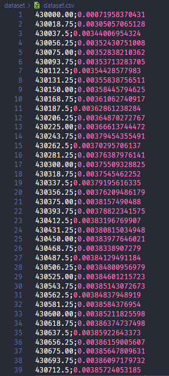
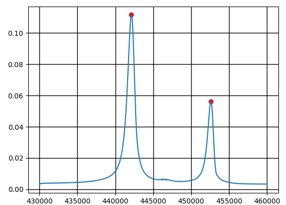

# Derivative Calculator

This application helps to calculate numerically the peaks from a list of points (x, y), using the definition of derivative bellow:

&space;-&space;f\left(&space;t&space;\right)}}{h&space;}>)

## 💻 Project

### Dataset used



### Result



## 🚀 Technologies

 Python3.7+

 Numpy

 Matplotlib

 Pandas


## 🏃 Usage

```bash
git clone https://github.com/douglasJovenil/derivative-calculator
cd derivative-calculator
pip install -r requirements.txt
cd src
python main.py
```